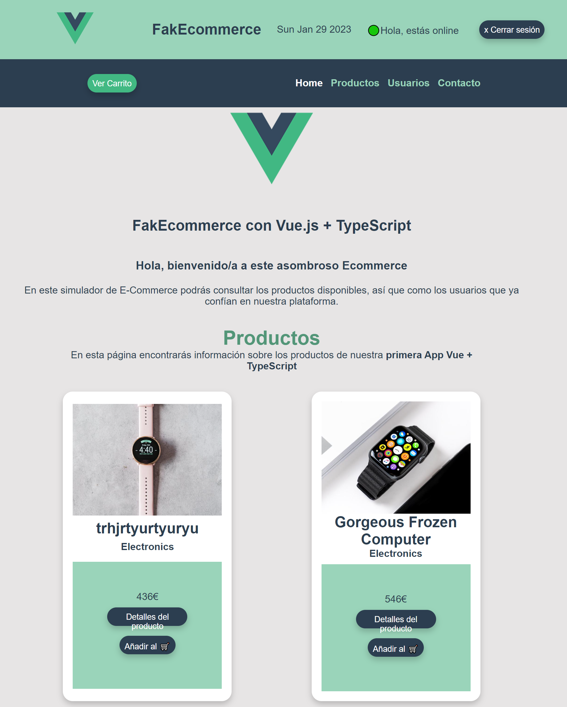

# FakEcommerce (Vue + TypeScript)

Esta es una práctica del *módulo Vue + TypeScript* del *Bootcamp Bootcamp Mujeres en Tech Glovo & KeepCoding* y simula una plataforma de comercio electrónico.



## Project setup
```
npm install
```

### Compiles and hot-reloads for development
```
npm run serve
```

### Compiles and minifies for production
```
npm run build
```

### Lints and fixes files
```
npm run lint
```

### Customize configuration
See [Configuration Reference](https://cli.vuejs.org/config/).
