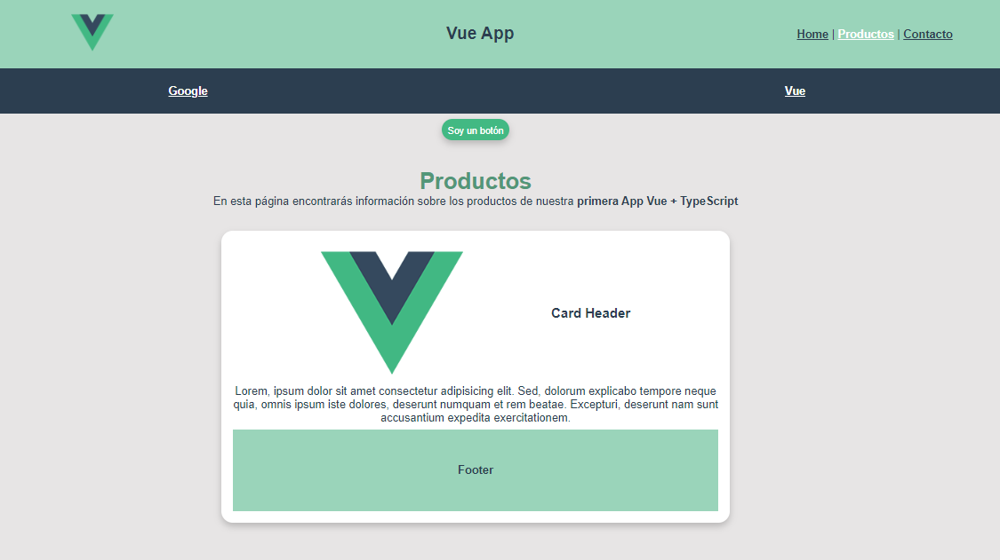

# Mi primer proyecto de Vue + TypeScript

<<<<<<< HEAD

=======

>>>>>>> 9498b0d1fcf7a0abccf8ce91fad0c610f1fc826b

## Project setup
```
npm install
```

### Compiles and hot-reloads for development
```
npm run serve
```

### Compiles and minifies for production
```
npm run build
```

### Lints and fixes files
```
npm run lint
```

### Customize configuration
See [Configuration Reference](https://cli.vuejs.org/config/).
